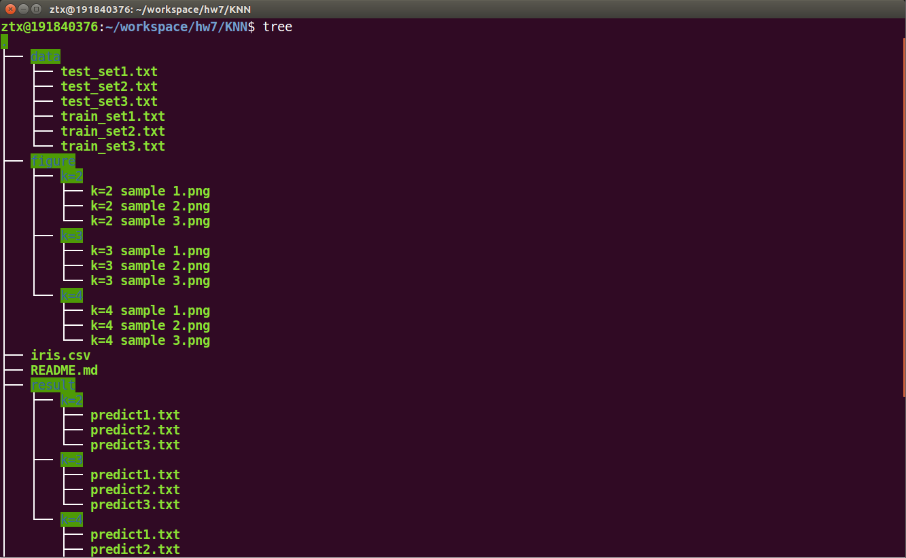
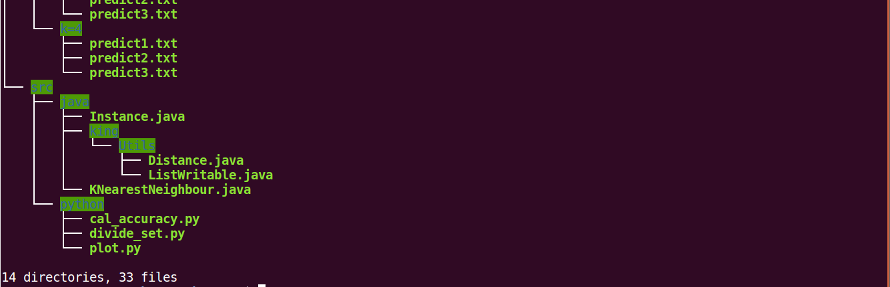

# <center>KNN的Mapreduce实现</center>

<center>朱彤轩 191840376</center>

[TOC]


## 1 作业要求

在MapReduce上任选一种分类算法（KNN，朴素贝叶斯或决策树）对Iris数据集进行分类预测，采用留出法对建模结果评估，70%数据作为训练集，30%数据作为测试集，评估标准采用精度accuracy。可以尝试对结果进行可视化的展示（可选）。

## 2 实现内容

选择KNN对Iris数据集进行分类预测。

### 2.1 生成测试集与训练集

训练集和测试集的比例为7: 3，采用若干次随机划分避免单次使用留出法的不稳定性。同时尽可能保持数据分布的一致性。避免因数据划分过程引入的额外偏差而对最终结果产生影响。在分类任务中，保留类别比例的采样方法称为“分层采样”（stratified sampling）。

运用python对数据集进行随机划分，选取70%作为训练集，30%作为测试集。同时数据集中一共有三类，所以在每一类中选取70%作为训练集，分层采样。生成了3组符合这样要求的样本进行实践。

训练集格式：

```
5.1	3.5	1.4	0.2	1
4.9	3	1.4	0.2	1
4.7	3.2	1.3	0.2	1
4.6	3.1	1.5	0.2	1
```

前四个数分别为Sepal.Length，Sepal.Width，Petal.Length，Petal.Width的具体数值，最后一个数字是分类。1代表setosa，2代表versicolor，3代表virginica。

测试集格式：

```
5.1	3.5	1.4	0.2	-1
4.9	3	1.4	0.2	-1
4.7	3.2	1.3	0.2	-1
4.6	3.1	1.5	0.2	-1
```

### 2.2 用Mapreduce实现KNN

#### 2.2.1 KNN算法简介

KNN的核心思想：离谁近就是谁。

具体解释为如果一个实例在特征空间中的K个最相似（即特征空间中最近邻）的实例中的大多数属于某一个类别，则该实例也属于这个类别。

其算法的描述为：

1. 计算测试数据与各个训练数据之间的距离；
2. 按照距离的递增关系进行排序；
3. 选取距离最小的K个点；
4. 确定前K个点所在类别的出现频率；
5. 返回前K个点中出现频率最高的类别作为测试数据的预测分类。

KNN不需要训练和求解参数，是一个天然的分类器。

#### 2.2.2 代码实现与执行

采用老师提供的书后代码，并进行一些修改。输入格式为：`<predict set path> <output path> <trainset path> <neighbour num>`。


对neighbour个数(k)为2，3，4进行尝试，测试随着neighbour个数的变化，对结果有着什么样的影响。对于每一个neighbour个数，用3组样本进行测试，避免因为划分集合产生的偶然性。

### 2.3 准确率

运用python，计算在测试集上预测结果的精度accuracy。accuracy是准确率，表示判定正确的次数与所有判定次数的比例。

#### 2.3.1 k=2

|          | accuracy |
| -------- | -------- |
| sample 1 | 93.3%    |
| sample 2 | 100%     |
| sample 3 | 93.3%    |

#### 2.3.2 k=3

|          | accuracy |
| -------- | -------- |
| sample 1 | 95.6%    |
| sample 2 | 100%     |
| sample 3 | 95.6%    |

#### 2.3.3 k=4

|          | accuracy |
| -------- | -------- |
| sample 1 | 95.6%    |
| sample 2 | 97.8%    |
| sample 3 | 95.6%    |

### 2.4 可视化

运用python中的matplotlib对结果进行可视化，选取k=3，sample 1进行展示：


由于数据有4个属性，所以选取三个属性设为xyz轴，用第四个属性作为散点图圈的大小。三种数据用不同的颜色展示。

从中可以看出，setosa与另外两类兰花有较大的差异，数据点小，且在三维空间中也与其他两种兰花有较大的距离。可以说，在所有的测试样本中，setosa没有被错分的情况。而versicolor与virginica两类兰花空间分布较劲，大小上也更接近，更容易被错分。

而且由于versicolor与virginica两类兰花数据的相似性，我们可以看到随着k的增加，并没有accuracy的显著提升，甚至k=3时的平均准确率比k=4还要好。这可能是分类的偶然情况，通过查资料，有如下说法：

> KNN中的K值选取对K近邻算法的结果会产生重大影响。如李航博士的一书「统计学习方法」上所说：如果选择较小的K值，就相当于用较小的领域中的训练实例进行预测，“学习”近似误差会减小，只有与输入实例较近或相似的训练实例才会对预测结果起作用，与此同时带来的问题是“学习”的估计误差会增大，换句话说，K值的减小就意味着整体模型变得复杂，容易发生过拟合；
>
> 如果选择较大的K值，就相当于用较大领域中的训练实例进行预测，其优点是可以减少学习的估计误差，但缺点是学习的近似误差会增大。这时候，与输入实例较远（不相似的）训练实例也会对预测器作用，使预测发生错误，且K值的增大就意味着整体的模型变得简单。
>
> K=N，则完全不足取，因为此时无论输入实例是什么，都只是简单的预测它属于在训练实例中最多的累，模型过于简单，忽略了训练实例中大量有用信息。

## 3 文件说明





- data文件夹

  用python划分的训练集和测试集，随机生成了三个

- figure文件夹

  分k=1,2,3; sample1,2,3的不同情况，对结果用python的matplotlib进行了可视化

- result文件夹

  分k=1,2,3; sample1,2,3的不同情况，记录了对test_set的预测label

- src文件夹

  java文件夹，mapreduce代码

  python文件夹，计算accuracy，划分训练测试集，画图代码

## 4 改进方向

1. 改进KNN的代码，进行加权平均，离得近的样本给予更大的权重，离得远的样本使其权重变小。
2. 目前对于超参数的尝试比较小，下面可以尝试用shell脚本“解放双手”